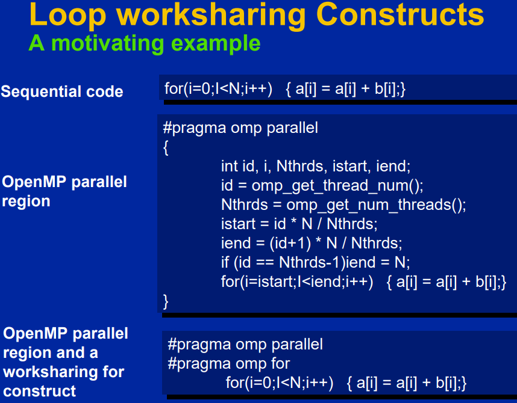
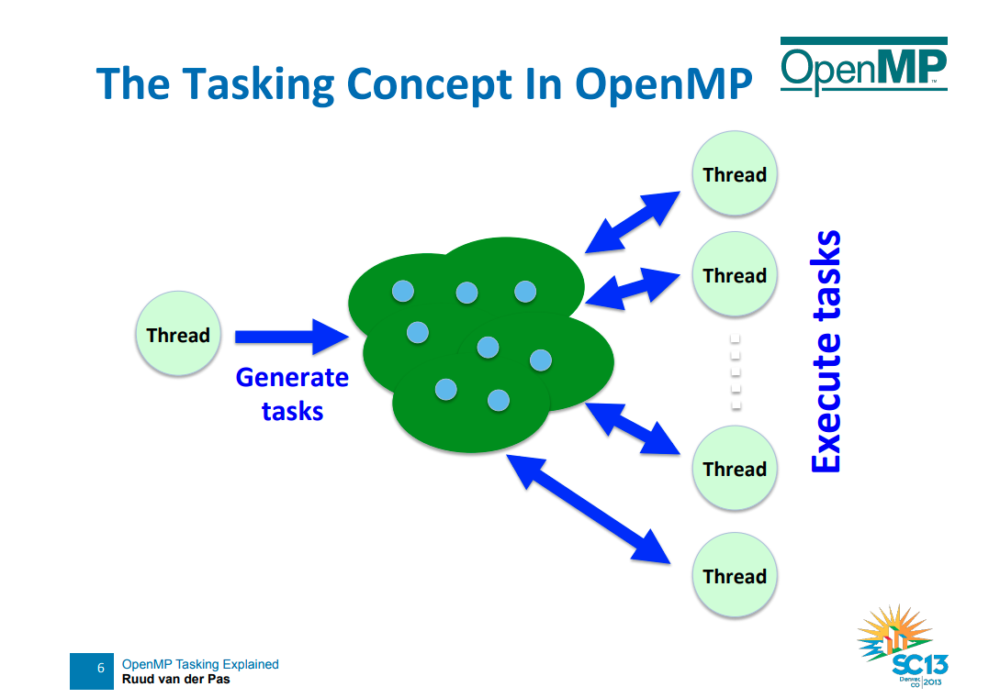
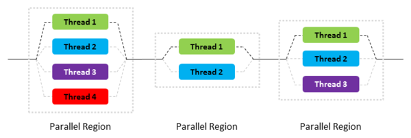
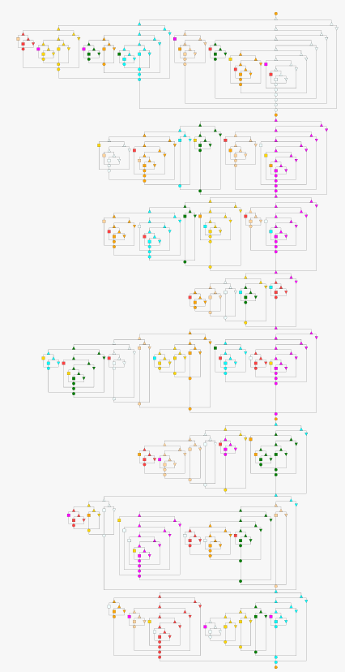
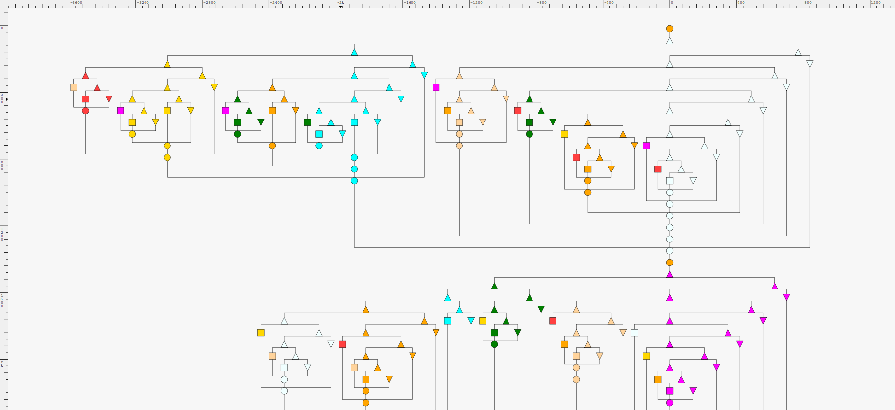
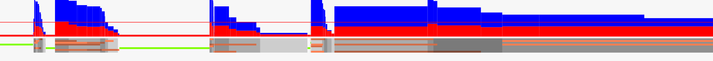
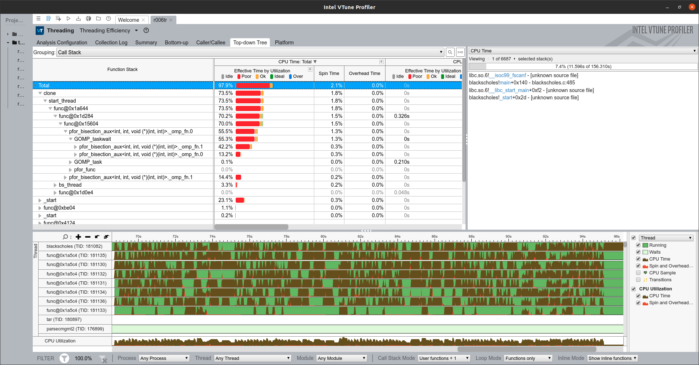
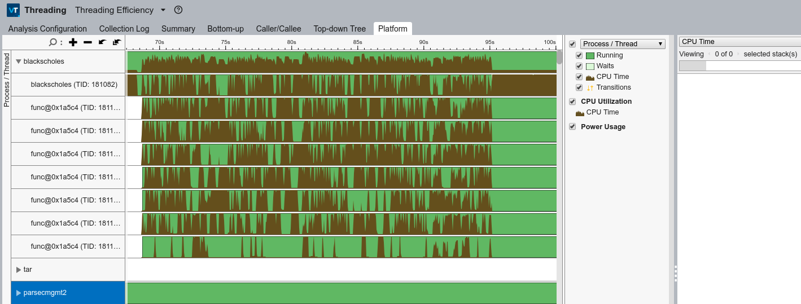

<!-- no_toc -->

# Profiling OpenMP tasks on TP-PARSEC benchmark suite

- [1. Progress so far](#1-progress-so-far)
- [2. Background concepts](#2-background-concepts)
- [3. Profiling OpenMP tasks on tp-parsec benchmark suite](#3-profiling-openmp-tasks-on-tp-parsec-benchmark-suite)
  - [3.1. DAGViz](#31-dagviz)
- [4. Results](#4-results)
  - [4.1. VTune](#41-vtune)
- [5. Appendix](#5-appendix)
  - [5.1. Installing vTune](#51-installing-vtune)
  - [5.2. HPC Toolkit](#52-hpc-toolkit)
  - [5.3. Installing Score-P on Ubuntu 20.04.1 LTS](#53-installing-score-p-on-ubuntu-20041-lts)
  - [5.4. Omp-Whip](#54-omp-whip)

## 1. Progress so far

- [x] Setup [tp-parsec](https://github.com/massivethreads/tp-parsec) suite, understand basics (contributed to documentation updates that can save time to the original repository[1](https://github.com/massivethreads/tp-parsec/pull/2) [2](https://github.com/massivethreads/tp-parsec/pull/3) [3](https://github.com/massivethreads/dagviz/pull/2))
- [x] Be able to run openmp-task workloads in Intel vtune for performance analyses
- [x] DAG visualization to see the DAG recorder outputs integrated in TP-PARSEC
- [x] Understood how OpenMP tasks work, replacements made by tp-parsec in source code
- [ ] HPC Tool kit, Score-P built but flow to be tried out
- [ ] Next steps: Understand the event scheduling of each task based on grain size
- [ ] Understand correlation of runtime vs parallelization with tasks vs threads (using the original PARSEC)
- [ ] Learn to trace source code (as opposed to assembly) in Vtune to help visualize the structure of task bifurcations on different cores/threads

- Papers/Documentation read
  - DAGViz: A DAG Visualization Tool for Analyzing Task-Parallel Program Traces
  - https://parsec.cs.princeton.edu/doc/man/man7/parsec.7.html
  - https://www.jstage.jst.go.jp/article/ipsjjip/27/0/27_211/_pdf/-char/en
  - https://ieeexplore.ieee.org/document/6337512
  - http://scorepci.pages.jsc.fz-juelich.de/scorep-pipelines/docs/scorep-6.0/html/instrumentation.html
  - http://hpctoolkit.org/manual/HPCToolkit-users-manual.pdf
  - https://press3.mcs.anl.gov//atpesc/files/2017/08/ATPESC_2017_Track-5_1_7-31_345pm_Mellor-Crummey-HPCToolkit.pdf
  - https://link.springer.com/chapter/10.1007/978-3-642-02303-3_11
  - [GCC vs ICC](http://citeseerx.ist.psu.edu/viewdoc/download?doi=10.1.1.679.1280&rep=rep1&type=pdf#:~:text=GCC%20stands%20for%20%E2%80%9CGNU%20Compiler,and%20Intel%2Dbased%20Android%20devices.)
  - https://www.openmp.org//wp-content/uploads/sc13.tasking.ruud.pdf

- Workloads (blackscholes,bodytrack,freqmine) can be parallelized by OpenMP from original PARSEC (More info [here](http://wiki.cs.princeton.edu/index.php/PARSEC))
- TP-PARSEC parallelizes PARSEC workloads into multiple task programming models which use task parallelism (i.e., lightweight user-level threads) instead of the restrictive parallel for loops like OpenMP's parallel for

## 2. Background concepts

- OpenMP is an API for writing **Multithreaded** Applications
  - A set of compiler directives (for C/C++) and library routines for parallel application programmers
  - omp_set_num_threads(4) - Runtime function to set number of threads
  - omp_get_thread_num() gets thread ID's (something like CUDA)
  - #pragma omp parallel is used to mark a parallel region of code
    - Each thread executes a copy of the code within the structured block on the same data (SPMD)
  - Synchronization to prevent race condition when sharing variables (for thread communication)
  - 
  - [Resource](https://www.openmp.org/wp-content/uploads/omp-hands-on-SC08.pdf)

- Task parallel programming model, task is a logical unit of concurrency which can be arbitrarily created at any point and dynamically scheduled on available cores. PFor can be expressed as tasks because tasks can be created anywhere. Dynamic/automatic load balancing simplifies scheduling.
- tp-parsec replaces "parallel for" with "pfor" (task version)
  - pfor divides the for loop iterations recursively into 2 halves and create two tasks executing them at each recursive level. create_task and wait_tasks. The grain size value indicates at what point the recursive division should stop and the leaf computation executed
  - Blackscholes
    - Nested loop of 100 x 10^7
    - Fine grained tasks with grain size 10k
  - Freqmine
    - 7 parallel for loops in PARSEC
      - Step 1: 1 for loop
      - Step 2: 4 for loops
      - Step 3: 2 for loops
    - In task version, pfor primitive is added in place of parallel for. Grain size is set to 1 for all 7 pfor.

Execution based on scheduling


Execution based on fixed threads (fork/join)


## 3. Profiling OpenMP tasks on tp-parsec benchmark suite

- All possible input options for a specific workload can be retrieved using: ```tp-parsec/pkgs/apps/blackscholes/inputs```
  - Inputs available: native, simlarge, simsmall, simmedium, simdev. Native is to be used on real machines
- Specific interest is on task_omp: Task based version of OpenMP

- Build/run on the blackscholes workload
```/home/rajesh/tp-parsec/tp-parsec/bin/parsecmgmt2 -a build run -p blackscholes -c gcc-task_omp -i simlarge -n 8```

- Build blackscholes workload with DAG recorder
```/home/rajesh/tp-parsec/tp-parsec/bin/parsecmgmt2 -a build run -p blackscholes -c gcc-task_omp-dr -i simlarge -n 8 # With DAG recorder```
  - Install dagviz using [this](https://github.com/massivethreads/dagviz) that can be used to open the *.dag in tp-parsec output directory (ex: pkgs/apps/freqmine/run/amd64-linux.gcc-task_omp-dr)

- For ICC compiler, be sure to update tp-parsec/config/icc.bldconf with the install paths

- Possible profiler options:
  - Intel Vtune
  - HPCToolkit
  - Score-P
  - Omp-Whip

### 3.1. DAGViz

Example with
```bash
/home/rajesh/tp-parsec/tp-parsec/bin/parsecmgmt2 -a build run -p freqmine -c gcc-task_omp-dr -i simlarge -n 8
```

**Note**: native inputs can take extremely long and crash with DAGrecorder enabled on DAGViz. Try using the sim inputs




Parallelism profile: GUI is better on PyQT. Can use vtune for this!



## 4. Results

- The benchmarks were run on the following configuration:

  ```txt
  Architecture:                    x86_64
  Byte Order:                      Little Endian
  Address sizes:                   39 bits physical, 48 bits virtual
  Thread(s) per core:              2
  Core(s) per socket:              4
  Socket(s):                       1
  Model name:                      Intel(R) Core(TM) i7-4700MQ CPU @ 2.40GHz
  CPU MHz:                         3192.259
  CPU max MHz:                     3400.0000
  CPU min MHz:                     800.0000
  ```

- tp-parsec logs are [here](./tp-parsec/logs)
- Metrics capture in the xls on the repository

### 4.1. VTune



Spawned threads


## 5. Appendix

### 5.1. Installing vTune

```bash
sudo apt-get install libgtk-3-0 libasound2 libxss1 libnss3
https://software.intel.com/content/www/us/en/develop/documentation/vtune-install-guide-linux/top/user-interface-install.html#user-interface-install
source <install-dir>/env/vars.sh
https://software.intel.com/content/www/us/en/develop/documentation/vtune-help/top/set-up-analysis-target/linux-targets/building-and-installing-the-sampling-drivers-for-linux-targets.html
https://software.intel.com/content/www/us/en/develop/documentation/vtune-help/top/installation/verify-linux-installation.html
echo "0"|sudo tee /proc/sys/kernel/yama/ptrace_scope
```

- https://www.cs.utexas.edu/~pingali/CS377P/2019sp/lectures/Intel_Tools-UT_Austin.pdf

### 5.2. HPC Toolkit

- [Install](http://hpctoolkit.org/software.html)

```bash
git clone https://github.com/spack/spack.git
cd spack/bin/
./spack install hpctoolkit
./spack install hpcviewer ^jdk@1.8.0_141-b15

```

- Flow

```bash
# HPCRun
~/tools/hpctoolkit/spack/opt/spack/linux-ubuntu20.04-haswell/gcc-9.3.0/hpctoolkit-2020.08.03-gxrlef3hst5bjnlmmnny4ypagzdv55cd/bin/hpcrun /home/rajesh/tp-parsec/tp-parsec/bin/parsecmgmt2 -a build run -p bodytrack -c gcc-task_omp -i native -n 2

# HPCStruct
~/tools/hpctoolkit/spack/opt/spack/linux-ubuntu20.04-haswell/gcc-9.3.0/hpctoolkit-2020.08.03-gxrlef3hst5bjnlmmnny4ypagzdv55cd/bin/hpcstruct /home/rajesh/tp-parsec/tp-parsec/pkgs/apps/bodytrack/inst/amd64-linux.gcc-task_omp/bin/bodytrack

# HPCProf
~/tools/hpctoolkit/spack/opt/spack/linux-ubuntu20.04-haswell/gcc-9.3.0/hpctoolkit-2020.08.03-gxrlef3hst5bjnlmmnny4ypagzdv55cd/bin/hpcprof --structure bodytrack.hpcstruct -I /home/rajesh/tp-parsec/tp-parsec/pkgs/apps/bodytrack/inst/amd64-linux.gcc-task_omp/bin/bodytrack/+ hpctoolkit-basename-measurements hpctoolkit-bash-measurements hpctoolkit-cat-measurements hpctoolkit-date-measurements hpctoolkit-dirname-measurements hpctoolkit-expr-measurements hpctoolkit-mkdir-measurements hpctoolkit-rm-measurements hpctoolkit-tee-measurements

# HPCViewer
~/tools/hpctoolkit/spack/opt/spack/linux-ubuntu20.04-haswell/gcc-9.3.0/hpcviewer-2020.07-5jhzze7aivxmalacdujvlgpqz662r5yz/bin/hpcviewer hpctoolkit-basename-database
```

### 5.3. Installing Score-P on Ubuntu 20.04.1 LTS

- [Install, docs](https://www.vi-hps.org/projects/score-p/)

```bash
sudo apt install python2
mkdir _build
cd _build/
../configure --prefix=/home/rajesh/tools/scorep-6.0 --with-mpi=openmpi
make
make install
```

### 5.4. Omp-Whip

- [This](https://github.com/rutgers-apl/omp-whip.git) did not work due to memory issues during build. Not sure if it's an issue with the my OS